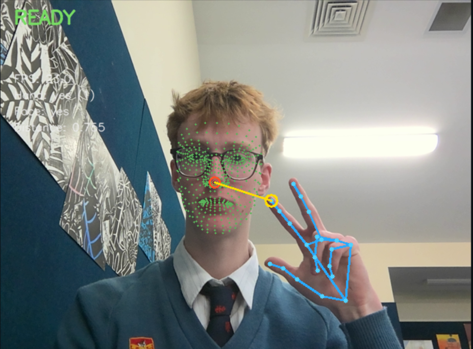

<p align="center">
  
</p>


## This is a project that takes your hand location and face location and tracks them to see when they overlap.

When the fingertip enters the forgiving nose touch zone, Gestures immediately
presses one configurable keyboard shortcut. A second configurable shortcut is
sent when the thumb and index finger touch together. Both shortcuts default to
`Alt + Tab` and can be changed from the GUI dropdowns. Each gesture fires once,
then requires release before it can fire again. When **Air Mouse** is enabled,
the index fingertip controls the OS pointer by camera position, a thumb-index
pinch performs a left click at the pointer location, and spreading the index and
middle fingers while moving scrolls in the direction of hand movement.

### QuickStart
##### In a folder of your choosing

```
gh repo clone lllons/Gestures
```
##### In the same folder
```
python -m venv venv
```
##### Then..
```
venv\Scripts\activate
```
##### Then...
```
python -m pip install -r requirements.txt
```
##### Then....
```
python scripts\download_models.py
```
##### Then.....
```
python -m app.main
```
Once you run this last command the GUI will launch and all you need to do it press **"START"**

The application does not open the webcam until **Start Detection** is pressed.

## How detection works

- MediaPipe Hand Landmarker returns up to two hands and 21 landmarks per hand.
- MediaPipe Face Landmarker returns a face mesh. Landmark 1 is used as the nose
  tip, and cheek landmarks 234 and 454 provide the face-width reference.
- For nose touch, landmark 8 — the actual index-finger tip — is considered for
  every hand. If two hands are visible, the hand whose index tip is closest to
  the detected nose is selected.
- For the pinch gesture, landmark 4 (thumb tip) and landmark 8 (index tip) are
  compared. Their distance is normalized by the wrist-to-middle-finger-palm
  length so the gesture remains consistent as the hand moves closer to the
  webcam.
- The normalized Euclidean distance is calculated as:

  ```text
  relative_distance = distance(index_tip, nose) / face_width
  ```

  This avoids a raw-pixel threshold changing when the user moves closer to the
  webcam.
- A moving average over five frames reduces nose-touch jitter. The detector
  reports `READY`, `APPROACHING`, `TOUCH DETECTED`, and `COOLDOWN`, while the
  pinch status is shown separately in the live diagnostics.
- The pinch shortcut fires when the normalized thumb-index distance is at most
  0.35 and is re-armed after the fingers separate. In Air Mouse mode, the same
  pinch performs a left click instead of sending the pinch keyboard shortcut.
- Air Mouse maps normalized index-fingertip coordinates directly to the virtual
  desktop, clamping the pointer to the available screen bounds. The Windows
  cursor path uses direct OS calls so pointer response stays consistent when
  another application is focused.
- Spreading the index and middle fingertips at least 0.65 palm lengths apart
  activates scrolling. Moving the hand down scrolls down; moving it up, left, or
  right scrolls in the matching direction. The gesture is active only in Air
  Mouse mode.
- The default cooldown timer is 0 ms for immediate response; release hysteresis
  still prevents a held gesture from sending repeated shortcuts.
- The activation zone size is 10% of face width by default, and the slider in
  the settings panel can increase it up to 50% for an even larger zone.
- The default activation delay is 0 ms, so the first qualifying frame triggers
  the shortcut. After it is sent, a cooldown and a separate release hysteresis
  require the fingertip to move outside the zone before a new trigger is armed.

----

## Settings storage and privacy

Settings are stored locally as JSON:

```text
%LOCALAPPDATA%\Gestures\settings.json
```

On non-Windows development machines the fallback is `~/.gestures/settings.json`.
The file contains UI values such as the camera index, activation zone, both
shortcuts, Air Mouse state, and calibration result. It does not contain camera
frames. The optional **Start with
Windows** setting creates/removes a per-user `HKCU` Run entry and does not need
administrator rights.

Windows may still show its normal camera privacy indicator while capture is
active. To use the app offline after setup, disconnect the network; no runtime
network request is needed.

## Packaging a standalone `.exe`

The requirements include PyInstaller. From an activated Windows virtual
environment, run:

```powershell
pyinstaller --noconfirm --clean --windowed --name Gestures `
  --collect-all mediapipe `
  --collect-all cv2 `
  --collect-all pynput `
  --add-data "models;models" `
  app\main.py
```

The executable is created at `dist\Gestures\Gestures.exe` (or the equivalent
PyInstaller output for your installed version). Test it on the target machine
with the two `.task` files included in the `models` directory. If you prefer a
single-file build, add `--onefile`; a one-file build extracts the models to a
temporary local directory at launch and still does not send them over the
network.

The first packaged launch may take longer while MediaPipe's native libraries
load. Windows Defender or camera privacy settings can also require an explicit
permission the first time.

## Troubleshooting

- **No webcam found**: close Teams/Zoom/OBS and other camera clients, verify
  Windows Settings → Privacy & security → Camera, then refresh the camera list.
- **MediaPipe model unavailable**: run `python scripts\download_models.py` from
  the repository root and confirm both `.task` files are under `models\`.
- **Face or hand not detected**: improve lighting, keep the face in view, and
  make sure the index fingertip is visible. The state remains safe and no key is
  sent without both landmarks.
- **Shortcut failure**: use the documented `pynput` names and test a simple
  shortcut such as `Space`. Some elevated applications may reject synthetic
  input unless Gestures is run with an appropriate Windows integrity level.
- **Air Mouse failure**: on Windows, allow Gestures to control the pointer and
  keep the index fingertip clearly visible. The pointer uses the mirrored camera
  coordinates, so moving your finger to the camera's top-right moves the pointer
  to the screen's top-right. Spread the index and middle fingers to scroll.
- **Slow FPS**: leave the preview off, use a 640×480 webcam mode, close other
  camera consumers, and allow MediaPipe to run on the CPU. The application does
  not require a dedicated GPU.

----

## Project layout

```text
app/
    main.py                 # python -m app.main entry point
    gui.py                  # Tkinter window and controls
    worker.py               # background camera/inference loop
    camera.py               # OpenCV camera enumeration/reconnect
    hand_tracker.py         # MediaPipe Hand Landmarker adapter
    face_tracker.py         # MediaPipe Face Landmarker adapter
    gesture_detector.py     # smoothing and trigger state machine
    keyboard_controller.py  # pynput shortcut parser/emitter
    calibration.py          # local two-stage calibration
    settings.py             # validated local JSON settings
    model_paths.py          # source/PyInstaller model lookup
    startup.py              # optional HKCU Windows startup entry
models/
    README.md
scripts/
    download_models.py
requirements.txt
```

License Apache License 2.0
